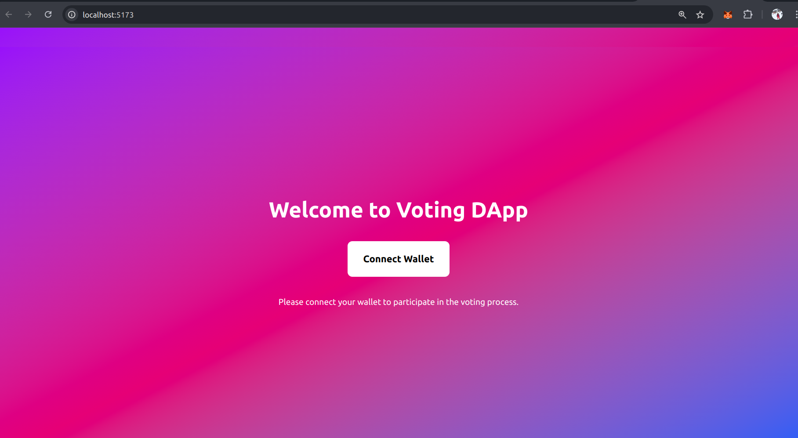
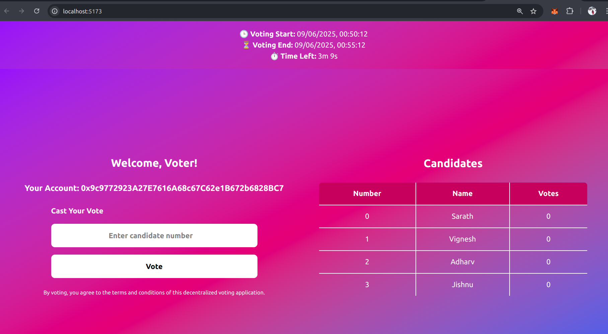
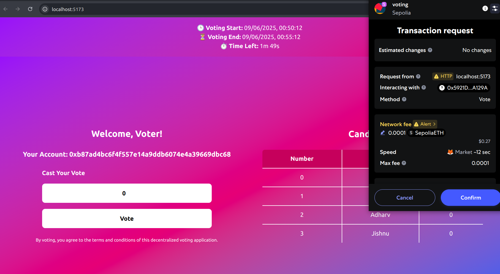
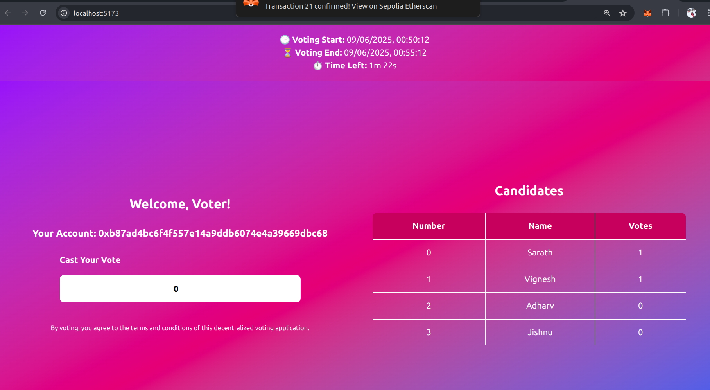
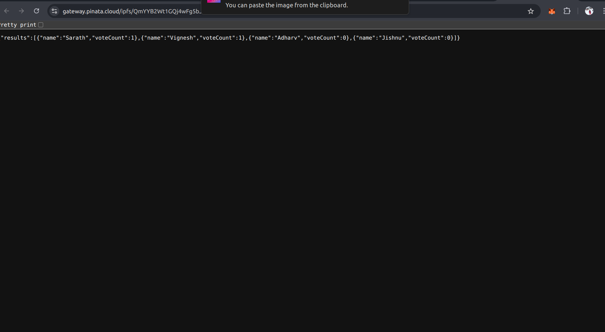

# 🗳️ Voting_Dapp  (EVM-Based)

A **decentralized voting application** built with **ReactJS** and **Solidity** for transparent, secure, and tamper-proof elections.

This DApp runs on **Localhost** and the **Ethereum Sepolia Testnet**, with smart contracts deployed via **Hardhat** and IPFS integration via **Pinata**.

---

## 🔥 Snapshots
### Login Screen


### HomePage





### Pinata



---

## 🛠️ Tech Stack

### Frontend:
- ⚡ **Vite.js** — Lightning-fast frontend build tool
- 🎨 **Tailwind CSS** — Utility-first styling
- 🔐 **MetaMask** — Web3 wallet for login and transactions
- 🔗 **ethers.js** — Ethereum interaction library

### Backend:
- ⚙️ **Hardhat** — Smart contract development framework
- ⛓️ **Solidity** — Smart contract language
- 🌐 **Alchemy** — Blockchain node provider (Sepolia)
- 📦 **Pinata + IPFS** — For decentralized file storage (vote result archival)

---

## 🚀 Run Locally

### 🔧 Backend (hardhat)

1. Navigate to the backend folder:
   ```bash
   cd hardhat
   ```

2. Install dependencies:
   ```bash
   npm install
   ```

3. Deploy the contract to Sepolia testnet:
   ```bash
   npx hardhat compile
   npx hardhat ignition deploy ignition/modules/Vote.js --network sepolia
   ```

4. Copy the deployed contract address and paste it in:
   ```
   frontend/src/constants/constant.js
   ```

---

### 💻 Frontend (Vite + React)

1. Navigate to the frontend folder:
   ```bash
   cd frontend
   ```

2. Install dependencies:
   ```bash
   npm install
   ```

3. Create a `.env` file in `frontend` and add your Pinata API credentials:
   ```env
   VITE_PINATA_API_KEY=your_api_key
   VITE_PINATA_SECRET_API_KEY=your_secret_key
   ```

4. Run the frontend:
   ```bash
   npm run dev
   ```

---

## 📦 IPFS Integration via Pinata

When the voting ends, the DApp automatically:

- Collects final voting results
- Uploads them to IPFS via **Pinata**
- Logs the resulting IPFS hash for permanent decentralized storage

You can verify the hash using any IPFS gateway like:
```
https://gateway.pinata.cloud/ipfs/<your_hash>


## 🎯 Features

- ✅ Connect with MetaMask
- 📋 List all candidates
- 🗳️ Cast your vote securely
- 🚫 Prevent double voting
- ⏱️ Countdown timer until voting ends
- 🏆 Display winner after voting ends
- 🌍 Automatically upload result JSON to IPFS

---

## 🧠 Project Status & Contributions

This project is complete and undergoing enhancements.

Feel free to fork, raise issues, or submit PRs.

If you find this helpful, drop a ⭐!
